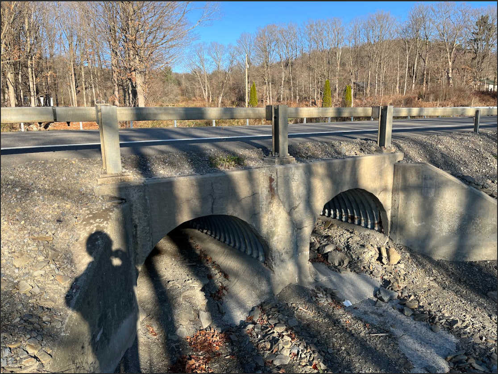
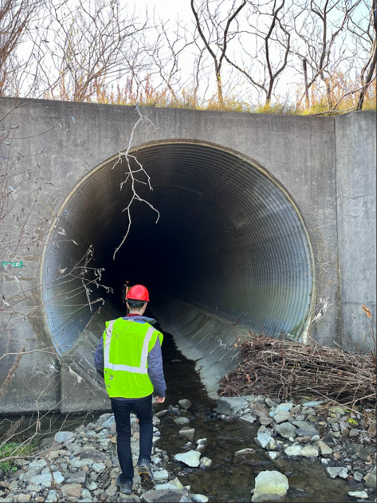

## 📝 Overview

<p float="left">
  
</p>


This project examines the spatiotemporal dynamics of flood risk within New York State's road networks, with a focus on the performance and behavior of large culvert drainage systems. It includes data preprocessing, hydrologic and hydraulic modeling, model validation, risk analysis, and visualization workflows used in the study.

<p align="center">
  
  
</p>

<p align="center">
  <em>Figure: Field photographs of culverts observed during a site visit to Upstate New York.</em>
</p>

---

## 📁 Repository Structure

The repository is organized into sequential modules that follow the full flood-risk modeling pipeline:

### Core Modules

- **`1. Data preprocessing/`**  
  Preparation and cleaning of raw datasets, including formatting, filtering, and structuring data for scalable and parallel processing.

- **`2. Hydraulic model/`**  
  Implementation of hydraulic computations for estimating culvert discharge capacity.

- **`3. Hydrologic model/`**  
  Watershed delineation, hydrologic parameter estimation, and peak-flow calculations.

- **`4. Validation/`**  
  Evaluation and verification of hydrologic and hydraulic outputs against reference data and independent models.

- **`5. Results/ Confident batch/`**  
  Spatio-temporal flood-risk analysis results and generation of spatial and temporal visualizations across the study region.

### Supporting Components

- **`A.1 AMC/`**  
  Analysis related to Antecedent Moisture Conditions (AMC) and their effect on runoff and peak-flow estimation.

- **`Environment/`**  
  Environment configuration file and dependencies required to reproduce the computational workflow.

- **`Image/`**  
  Figures used in the README and related materials.


**Note:**  
The folders are intended to be executed in order, starting from data preprocessing and proceeding through modeling, validation, and results generation.

---

## 🚀 Getting Started

To run the analysis:

1. Clone the repository:
   ```bash
   git clone https:https://github.com/omidemam/CRISIS_Management.git
   cd CRISIS_Management

---

## 📬 Contact

For questions, feedback, or collaboration opportunities, please email me at: [omid.emamjomehzadeh@nyu.edu](mailto:omid.emamjomehzadeh@nyu.edu)

---
   
## 📚 Citation

If you use this repository in your research or projects, please cite it as follows:

BibTeX format:

```bibtex
@misc{emamjomehzadeh_wani_2026,
  author       = {Emamjomehzadeh, Omid and Wani, Omar},
  title        = {Scalable flood-risk analysis for New York State culvert infrastructure reveals patterns of dependence},
  year         = {2026},
  doi          = {https://doi.org/10.1038/s43247-026-03550-8},
  note         = {Communications Earth \& Environment}
}

